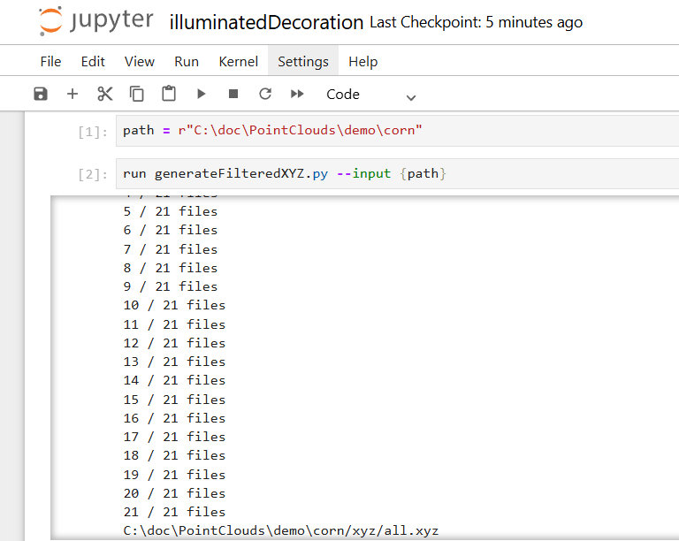

# Merge Point Cloud

These scripts provide a function to generate illuminated decoration using point cloud data.

## How to run this script

Open illuminatedDecoration.ipynb, and then set up a path to a folder which stores three types of data. Three types of data are a jpeg file, a depth map, and a json file which stores inverse camera intrinsic matrix. Finally, run generateFilteredXZ.py with path, which results in a generation of point cloud data in a xyz folder.

  

